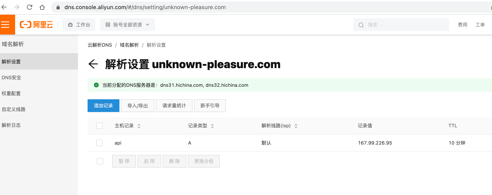

1. create dokku droplet in digital ocean
    1. create ssh key in local machine and upload that to digital ocean
        
        > `ssh-keygen`
    
    2. if the generated droplet is not pingable, drop it and create another

2. ssh into the remote droplet/server
    > `ssh root@<the ip of the created droplet>`

3. create the backend app by using dokku on remote server
    > `dokku apps:create api`

4. install dokku postgres plugin
    > `sudo dokku plugin:install https://github.com/dokku/dokku-postgres.git`

5. create postgres db instance(kewldb) on remote server
    > `dokku postgres:create kewldb`

6. link remote db instance to backend app
    > `dokku postgres:link kewldb api`

7. install dokku redis plugin
    > `sudo dokku plugin:install https://github.com/dokku/dokku-redis.git redis`

8. create redis instance(kewlredis) on remote server
    > `dokku redis:create kewlredis`

9. link remote redis isntance to backend app
    > `dokku redis:link kewlredis api`

10. could check the db and redis container/instance just created by 
    > `docker container list`
    
11. https://nodejs.org/en/docs/guides/nodejs-docker-webapp/
    * create Dockerfile (super important to write this correctly)
    * create .dockerignore

12. https://github.com/nodejs/docker-node/blob/master/docs/BestPractices.md
    * add `ENV NODE_ENV production` to Dockerfile
    * add `USER node` to Dockerfile 

13. build docker image 
    > `docker build -t lyslim/kewl-server:test .`

14. before pushing the image to docker server, change environment variables
    * add .env file
    * `npm install dotenv-safe` 
    * and .env-example file
    * generate types for .env file & wrote .env.example file
       > `npx gen-env-types .env -o src/env.d.ts -e .`
       could add that into npm script
    * `import "dotenv-safe/config";` in `type-orm.config.ts` - it safeguards the .env file by cross-checking variables in .env.example file - e.g. if a variable in .env.example does not exist in .env file, it will throw an error in run time.
    * create .env.production to store those variables which would not be inserted by dokku, e.g. SESSION_SECRET, then in Dockerfile, copy and rename it to .env .

15. add `app.set('trust proxy', 1);` in `index.ts` to let app know there's nginx proxy sitting in front, so cookie can get through

16. comment out the develop migration and create a new migration file ready for prodution(initialize db in production)
    * comment out old migration files(files for develop use)
    * create ormconfig.json - specify new db name here - the purpose is to create a initial migration file(which creates all tables when production env initializes) based on this ormconfig.json. So this file is an one-off thing, which would not be used for actual production run time code.
    * `npm run build` - rebuild/regenerate dist folder
    * `npx typeorm migration:generate -n Initial` - generate the initial migration file.
    * put the migration file above to `/migrations` folder, so that it would get run when the app initialize.
        * NOTE: if migration failed saying sth. like
        > ```NoExplicitTypeError: Unable to infer GraphQL type from TypeScript reflection system. You need to provide explicit type for 'creator' of 'Post' class.```

        you need to go back to entity file and fix the Graphql inferring type, e.g. `@Field(() => User)`

17. re-build docker image (coz we already changed our code)
    
    ~~> `docker build -t lyslim/kewl-server:1 .`~~
    
    when using m1 mac, should specify the platform
    > `docker build --platform linux/amd64 -t lyslim/kewl-server:1 .`

    This time name it to 1, meaning version 1.
    The whole idea is to build a docker image wrapping the whole app, upload it to docker hub, then pull it from docker hub via dokku in the VPS.
    
18. `docker login` if not already

19. push the docker image to docker hub
    > `docker push lyslim/kewl-server:1` 

20. ssh into vps, then pull the docker image to the vps
    > `docker pull lyslim/kewl-server:1`

21. retag the image to match the created app
    > `docker tag lyslim/kewl-server:1 dokku/api:latest`

22. deploy tag
    > `dokku tags:deploy api latest`

23. point your domain to the vps
    * in domain provider, add one A record to point to the VPS IP address
    

24. check dns propogation - https://www.whatsmydns.net/

25. fix the domain host in dokku
    1.  run `dokku domains:report`, will get something like
        ```
            Domains app enabled:           true                     
            Domains app vhosts:            api.dokku0214onubuntu2004-s-1vcpu-1gb-nyc1-01
            Domains global enabled:        true                     
            Domains global vhosts:         dokku0214onubuntu2004-s-1vcpu-1gb-nyc1-01 
        ```
        the `domains app vhosts` and `domains global vhosts` are not correct, need to change to use our custom domain.

    2. run `dokku domains:remove-global dokku0214onubuntu2004-s-1vcpu-1gb-nyc1-01` to remove global domain ,then run `dokku domains:add-global unknown-pleasure.com` to add our domain to global.

    3. run `dokku domains:remove api api.dokku0214onubuntu2004-s-1vcpu-1gb-nyc1-01` to remove app domain, then run `dokku domains:add api api.unknown-pleasure.com` to add our app domain.

    4. use `dokku domains:report` to verify.

26. fix the port
    1. check current port
        > `dokku proxy:ports api` 
    2. map 8080 to 80
        > `dokku proxy:ports-add api http:80:8080`

27. setup https
    1. install letsencrypt
        > `sudo dokku plugin:install https://github.com/dokku/dokku-letsencrypt.git`
    2. set DOKKU_LETSENCRYPT_EMAIL
        > `dokku config:set --no-restart api DOKKU_LETSENCRYPT_EMAIL=theycallmek@163.com`
    3. encrypt the app, without step 26, this will fail.
        > `dokku letsencrypt:enable api`

**Trick**:
1. in ssh terminal, use ctrl + r to look up commands, and right arrow to select it.
2. cookie - https://github.com/benawad/how-to-debug-cookies 
